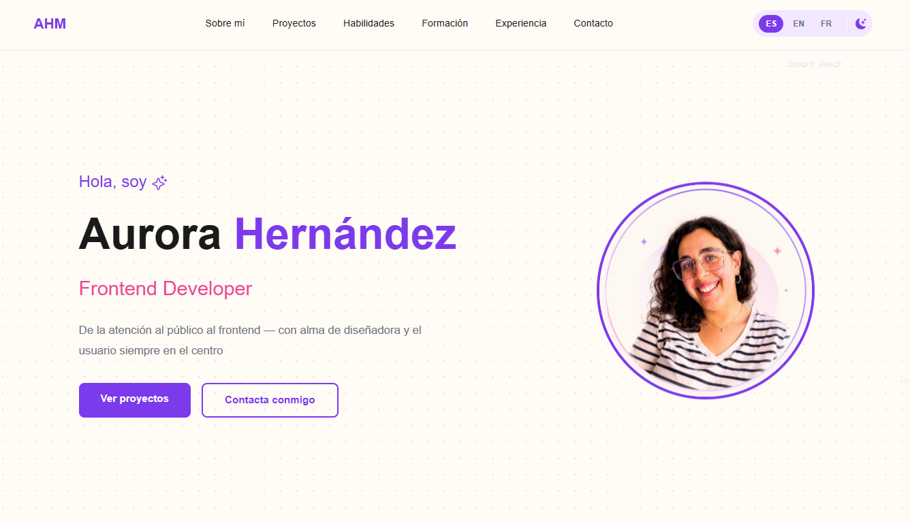

# AHM Portfolio

Portfolio personal de Aurora Hernández, Frontend Developer. Construido con React, TypeScript y Tailwind, con soporte multi-idioma y modo oscuro.



🔗 **Demo en vivo:** [project-v3yxp.vercel.app](https://project-v3yxp.vercel.app/)

## Tecnologías

- **React 19** + **TypeScript**
- **Vite** como bundler
- **Tailwind CSS v4**
- **react-i18next** — contenido disponible en Español, Inglés y Francés
- **GSAP** — animaciones al hacer scroll
- **react-icons** — iconografía de tecnologías y redes

## Características

- 🌗 Modo claro / oscuro con paleta de colores propia
- 🌍 Selector de idioma (ES / EN / FR)
- 📱 Diseño responsive (navegación adaptada a mobile con menú hamburguesa)
- ✨ Animaciones de entrada y scroll con GSAP
- 🗂️ Secciones: Sobre mí, Proyectos, Habilidades, Formación, Experiencia y Contacto

## Instalación local

```bash
git clone https://github.com/aurohm97-cell/portfolio_aurora.git
cd portfolio_aurora
npm install
npm run dev
```

## Despliegue

Desplegado en **Vercel**, con integración continua desde la rama principal del repositorio.

## Contacto

¿Quieres saber más sobre este proyecto o sobre mí? Visita la sección de contacto en el propio portfolio.